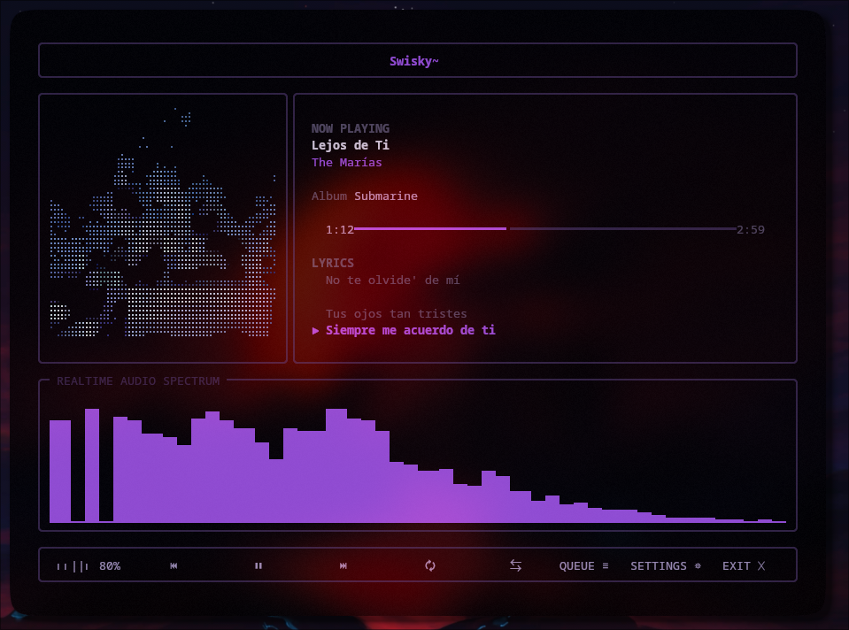

# Swisky Terminal Player

A fully terminal-based music player that delivers a desktop-class experience —
ultra-high-fidelity TrueColor ASCII album art, a real-time FFT spectrum
visualizer, synchronized lyrics, and a VS Code-style command palette — without
ever leaving your terminal.




## Highlights

- **98–99%-fidelity ASCII album art** via a full image-enhancement pipeline
  (Lanczos → CLAHE → histogram equalization → auto contrast → adaptive
  brightness → gamma → sharpen → edge enhancement → denoise → tone mapping →
  edge-aware adaptive character mapping), rendered in three engines:
  Classic ramp, Unicode block-shade, and Ultra-HD Braille (2×4 dot packing —
  ~4x the effective resolution of a plain character ramp).
- **Every pixel keeps its color** — TrueColor (24-bit) ANSI throughout.
- **Real-time FFT spectrum visualizer**, decoded independently of playback so
  the bars reflect what's actually in the audio, not a canned animation.
- **Synchronized `.lrc` lyrics** with smooth auto-scroll and manual offset.
- **A real playback engine** (libmpv via `python-mpv`) — MP3, FLAC, WAV, OGG,
  AAC, OPUS, M4A, AIFF.
- **Hot-reloading library** — add/remove files in your music folder and the
  app picks it up without a restart.
- **A VS Code–style command palette** (`Ctrl+P`): `seek 01:35`, `volume 80`,
  `theme purple`, `ascii braille`, `scan library`, etc.
- **Every visible control is real.** No decorative panels, no dummy buttons.

## Requirements

- Arch Linux (or any modern Linux distro)
- Python 3.12+
- `libmpv` — `sudo pacman -S mpv`
- A TrueColor terminal: Kitty, Ghostty, WezTerm, or Alacritty

## Install

```bash
git clone https://github.com/vanswisky/swisky-terminal-player
cd swisky-terminal-player
python3 -m venv .venv && source .venv/bin/activate
pip install -r requirements.txt
```

## Run

```bash
python src/main.py                      # scans ./assets/music by default
python src/main.py ~/Music ~/Downloads  # or point it at your own folders
```

Drop `.lrc` files into `assets/lyrics/<track-filename>.lrc` (or right next to
the audio file) for synchronized lyrics.

## Keyboard shortcuts

| Key                  | Action                      |
|-----------------------|------------------------------|
| `Space`               | Play / Pause                 |
| `←` / `→`             | Seek -5s / +5s                |
| `Ctrl+←` / `Ctrl+→`   | Seek -30s / +30s              |
| `↑` / `↓`             | Volume up / down               |
| `N` / `P`             | Next / Previous track          |
| `R`                   | Cycle repeat (off/all/one)     |
| `S`                   | Toggle shuffle                 |
| `L`                   | Toggle lyrics                  |
| `A`                   | Cycle ASCII render mode        |
| `C`                   | Reload album cover              |
| `V`                   | Toggle visualizer               |
| `Ctrl+P`              | Open command palette             |
| `Esc`                 | Open settings                    |
| `Q`                   | Quit                              |

Mouse: click the progress bar to seek, scroll anywhere to adjust volume
(terminal mouse reporting required — enabled automatically if supported).
Click **QUEUE** on the control bar (or run `queue` / `playlist` in the
command palette) to open the queue screen.

### Queue screen

| Key                  | Action                        |
|-----------------------|--------------------------------|
| `↑` / `↓`             | Move the selection              |
| `Enter`               | Play the selected track         |
| `N` / `P`             | Move the selected track down/up |
| `D` / `Backspace`     | Remove the selected track       |
| `Esc`                 | Close                            |

### Settings screen

| Key                  | Action                        |
|-----------------------|--------------------------------|
| `↑` / `↓`             | Select a setting                |
| `←` / `→`             | Change the selected setting     |
| `Esc`                 | Close and save                   |

## Architecture

Each module has one job; nothing here is a monolith.

```
src/
  main.py              entry point — wires every subsystem together
  config.py            typed settings schema + defaults
  constants.py          static values: char ramps, formats, key IDs
  theme.py / theme_manager.py   cyberpunk color palettes, runtime swap

  audio_engine.py       thin libmpv wrapper (the only module that touches mpv)
  player.py             transport logic: play/pause/seek/volume/repeat/shuffle
  playlist_manager.py   library browsing: search/filter/sort/save/load
  queue_manager.py      the actual "what plays next" queue

  metadata.py           mutagen-based tag + embedded cover extraction
  scanner.py            recursive library scan + watchdog hot-reload
  lyrics_manager.py     .lrc parsing + time-synced active-line lookup

  ascii_renderer.py     THE core engine: image pipeline -> ASCII/Braille/Block
  ascii_cache.py         memory + disk caching keyed on (cover, size, mode, quality)
  visualizer.py          independent PCM decode + real-time FFT banding

  widgets.py             pure render functions (state -> rich renderable)
  ui.py                  Live loop, layout, input dispatch, mouse hit-testing
  keyboard_handler.py    raw-terminal key reader (thread + queue)
  mouse_handler.py       SGR mouse-report decoder
  command_palette.py     VS Code-style command registry + fuzzy suggestions
  settings_items.py      single source of truth for the Settings screen's
                          rows: label, display value, and what ←/→ do to it
  settings_manager.py    atomic JSON persistence for AppConfig
  utils.py               dependency-free helpers (time fmt, hashing, term size)
```

### Why the ASCII renderer looks the way it does

Classic "brightness → character" ASCII art assumes dark ink on light paper.
On a terminal, we're drawing colored glyphs on a *black* background, so the
mapping is inverted: bright pixels get dense glyphs (more colored coverage =
visually brighter cell), dark pixels get sparse glyphs or space (background
shows through = visually darker cell). Character density additionally blends
in local edge strength (Sobel gradient magnitude), so structural detail —
eyes, hairlines, jaw edges — stays legible even in flat-brightness regions
instead of washing out.

### Why the visualizer doesn't tap mpv's audio pipeline directly

`libmpv` doesn't expose a simple "give me the raw samples currently playing"
hook. Instead, `visualizer.py` decodes the track's PCM once (on a background
thread, off the UI thread) and — every frame — windows out the ~93ms slice
that corresponds to mpv's *reported playback position*, FFTs it, and bins it
into log-spaced bands. The result tracks the real audio; it just gets there
by re-reading the same file rather than intercepting mpv's internals.

## Extending

- Add a new ASCII mode: add an entry to `AsciiRenderMode` in `config.py` and
  a `_render_xxx` method in `ascii_renderer.py`.
- Add a command-palette command: one `self.command_palette.register(...)`
  call in `ui.py`'s `_register_commands`.
- Add a theme: one new `Theme(...)` instance in `theme.py`.

## License

MIT — see `LICENSE`.
