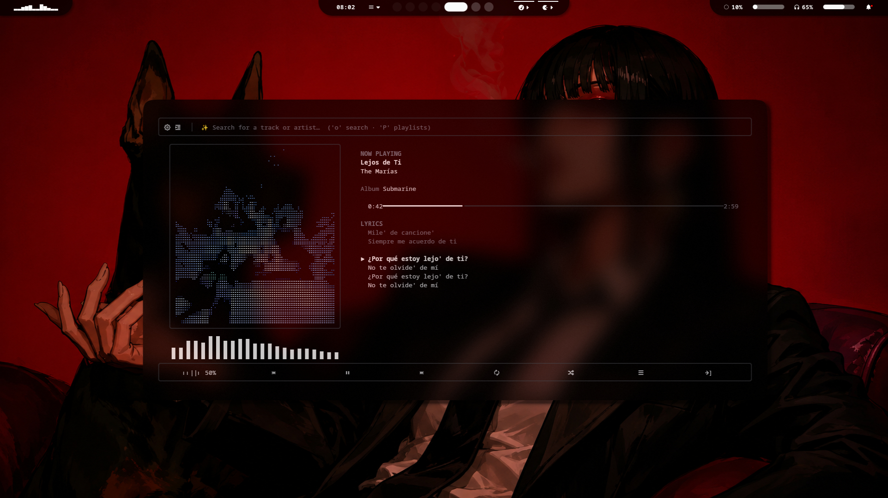

# 🎧 Swisky Terminal Player

<p align="center">
  <strong>A premium music player built entirely for the terminal.</strong>
</p>

<p align="center">
  <em>Desktop-class experience · TrueColor visuals · Real-time audio · Zero GUI</em>
</p>

<p align="center">


</p>

<p align="center">
  
</p>

---

## ✦ What is Swisky Terminal Player?

**Swisky Terminal Player** is a full-featured music player designed to live entirely inside your terminal.

No GTK.  
No Qt.  
No Electron.  
No desktop window.

Just your terminal — rendered with **24-bit TrueColor**, real-time audio analysis, synchronized lyrics, high-fidelity ASCII artwork, and an interactive interface designed to feel closer to a desktop music application than a traditional CLI tool.

> **A music player that doesn't pretend the terminal is a limitation.**

---

## ✨ Highlights

### 🎨 High-Fidelity ASCII Album Art

Album artwork is processed through a multi-stage image pipeline before being rendered inside the terminal:

```text
Lanczos
   ↓
CLAHE
   ↓
Histogram Equalization
   ↓
Auto Contrast
   ↓
Adaptive Brightness
   ↓
Gamma Correction
   ↓
Sharpen
   ↓
Edge Enhancement
   ↓
Denoise
   ↓
Tone Mapping
   ↓
Edge-Aware Character Mapping
```

Three rendering engines are available:

- **Classic** — traditional ASCII character ramp
- **Block** — Unicode block-shade rendering
- **Braille** — Ultra-HD Braille using 2×4 dot packing

Braille mode provides roughly **4× the effective resolution** of a standard character ramp.

And because the renderer uses **24-bit ANSI TrueColor**, the artwork keeps its original color information instead of becoming monochrome ASCII.

---

### 📊 Real-Time FFT Visualizer

The spectrum visualizer isn't a canned animation.

It independently decodes the audio, follows the player's reported playback position, performs FFT analysis, and converts the result into logarithmically spaced frequency bands.

```text
Audio
  │
  ▼
PCM Decode
  │
  ▼
Playback Position
  │
  ▼
~93ms Audio Window
  │
  ▼
FFT
  │
  ▼
Log-Spaced Bands
  │
  ▼
Terminal Visualizer
```

The result is a visualizer that reacts to the **actual audio being played**.

---

### 🎤 Synchronized Lyrics

Supports synchronized `.lrc` lyrics with:

- Timestamp-based synchronization
- Smooth auto-scroll
- Active-line tracking
- Manual offset
- Local `.lrc` files
- Automatic fallback fetching from `lrclib.net`
- Disk caching after retrieval

Place lyrics at:

```text
assets/lyrics/<track-filename>.lrc
```

or directly beside the audio file.

---

### 🎵 Real Playback Engine

Powered by **libmpv** through `python-mpv`.

Supported formats include:

```text
MP3
FLAC
WAV
OGG
AAC
OPUS
M4A
AIFF
```

Playback controls include:

- Play / Pause
- Seek
- Volume
- Shuffle
- Repeat
- Previous / Next
- Queue management

---

### 🔄 Hot-Reloading Music Library

Add or remove music files from your library without restarting the application.

The scanner watches your music directories and automatically updates the library.

```text
Music Folder
     │
     ├── song-a.mp3
     ├── song-b.flac
     └── song-c.wav
             │
             ▼
       Library Scanner
             │
             ▼
        Live Library
```

---

### ⌘ VS Code-Style Command Palette

Press:

```text
Ctrl + P
```

and control the player through commands.

Examples:

```text
seek 01:35
volume 80
theme purple
ascii braille
scan library
queue
playlist
online lofi
```

---

### 🎛️ Everything Is Functional

Every visible control exists for a reason.

There are:

- No fake buttons
- No decorative controls pretending to work
- No dummy panels
- No static visualizer animations

The UI is designed around actual player state and real interactions.

---

# 🖥️ Requirements

### Operating System

- Arch Linux
- Other modern Linux distributions should work as well

### Runtime

- Python **3.12+**
- `libmpv`

Install `mpv` on Arch Linux:

```bash
sudo pacman -S mpv
```

### Terminal

A TrueColor-capable terminal is recommended:

- Kitty
- Ghostty
- WezTerm
- Alacritty

### Nerd Font

A **Nerd Font is required** for several UI icons.

Recommended fonts:

- MesloLGS Nerd Font
- FiraCode Nerd Font
- JetBrainsMono Nerd Font

The interface uses patched Private Use Area glyphs from Font Awesome, Codicons / VS Code icons, and Material Design Icons. A normal Unicode font may therefore display some icons as empty boxes (`□`).

---

# 🚀 Installation

```bash
git clone https://github.com/vanswisky/swisky-terminal-player.git
cd swisky-terminal-player
python3 -m venv .venv
source .venv/bin/activate
pip install -r requirements.txt
```

---

# ▶️ Running

Run the player using the default music directory:

```bash
python src/main.py
```

By default, the application scans:

```text
./assets/music
```

You can also provide your own directories:

```bash
python src/main.py ~/Music ~/Downloads
```

For synchronized lyrics, place `.lrc` files in:

```text
assets/lyrics/<track-filename>.lrc
```

or next to the audio file.

---

# 🎮 Controls

| Key | Action |
|:---:|---|
| `Space` | Play / Pause |
| `←` / `→` | Seek −5s / +5s |
| `Ctrl + ←` / `Ctrl + →` | Seek −30s / +30s |
| `↑` / `↓` | Volume Up / Down |
| `N` / `P` | Next / Previous Track |
| `R` | Cycle Repeat |
| `S` | Toggle Shuffle |
| `L` | Toggle Lyrics |
| `A` | Cycle ASCII Mode |
| `C` | Reload Album Cover |
| `V` | Toggle Visualizer |
| `Ctrl + P` | Command Palette |
| `Esc` | Settings |
| `Q` | Quit |

### Mouse

- Click the progress bar → Seek
- Scroll anywhere → Adjust volume
- Click **QUEUE** → Open queue

Terminal mouse reporting is enabled automatically when supported.

---

# 📋 Queue

| Key | Action |
|:---:|---|
| `↑` / `↓` | Move selection |
| `Enter` | Play selected track |
| `N` / `P` | Move selected track |
| `D` / `Backspace` | Remove selected track |
| `Esc` | Close |

---

# ⚙️ Settings

| Key | Action |
|:---:|---|
| `↑` / `↓` | Select setting |
| `←` / `→` | Change setting |
| `Esc` | Close and save |

---

# 🌐 Online Search

Press `O` or run:

```text
online <query>
```

The search interface stays inside the main player, so the currently playing track can continue while you search.

Search uses the **iTunes Search API** for metadata and falls back to YouTube search when iTunes returns no result.

No API key, account, or sign-up is required.

Once a result is selected, the application resolves the matching YouTube audio stream through `yt-dlp`.

Metadata and cover artwork remain from iTunes when available; the audio source is YouTube.

### Online Playlist

```text
online playlist <query>
```

or press `TAB` inside the search screen.

Each track attempts to obtain clean title, artist, album, and cover metadata from iTunes while the audio remains resolved from YouTube.

### Search Controls

| Key | Action |
|:---:|---|
| Typing | Build query |
| `Enter` | Search / Play selected result |
| `↑` / `↓` | Select result |
| `A` | Add result to queue |
| Typing again | Start a new query |
| `Esc` | Close |

Online search requires `yt-dlp`, included in `requirements.txt`, and `online.enabled` must be enabled in Settings.

> **Note:** Streaming resolved audio from YouTube may have legal or Terms of Service implications. Use the feature responsibly and primarily for personal use.

---

# 🧠 Architecture

Each module has a focused responsibility rather than placing the entire application inside a single monolithic module.

```text
src/
│
├── main.py
│   └── Application entry point
│
├── config.py
│   └── Typed settings schema + defaults
│
├── constants.py
│   └── Static values, character ramps, formats, key IDs
│
├── theme.py / theme_manager.py
│   └── Cyberpunk palettes + runtime theme switching
│
├── audio_engine.py
│   └── Thin libmpv wrapper
│
├── player.py
│   └── Playback transport logic
│
├── playlist_manager.py
│   └── Library search/filter/sort/save/load
│
├── queue_manager.py
│   └── Playback queue
│
├── metadata.py
│   └── Tags + embedded artwork
│
├── scanner.py
│   └── Recursive scanning + hot reload
│
├── lyrics_manager.py
│   └── LRC parsing + synchronized lyrics
│
├── online_source.py
│   └── iTunes metadata + YouTube resolution
│
├── ascii_renderer.py
│   └── ASCII / Block / Braille rendering engine
│
├── ascii_cache.py
│   └── Memory + disk rendering cache
│
├── visualizer.py
│   └── PCM decoding + FFT visualization
│
├── widgets.py
│   └── Pure UI rendering functions
│
├── ui.py
│   └── Layout + interaction + mouse handling
│
├── keyboard_handler.py
│   └── Raw terminal keyboard input
│
├── mouse_handler.py
│   └── SGR mouse decoding
│
├── command_palette.py
│   └── Command registry + fuzzy suggestions
│
├── settings_items.py
│   └── Settings screen definitions
│
├── settings_manager.py
│   └── Atomic configuration persistence
│
└── utils.py
    └── Shared dependency-free helpers
```

---

# 🔬 Under the Hood

## ASCII Rendering

Traditional ASCII art maps brightness directly to character density.

On a terminal, characters are rendered on a dark background, so Swisky Terminal Player reverses the mapping:

```text
Bright Pixel
     ↓
Dense Character
     ↓
More Colored Coverage
     ↓
Brighter Visual Result
```

Dark pixels use sparse characters or spaces, allowing the terminal background to contribute to perceived darkness.

Character density also incorporates local edge strength using **Sobel gradient magnitude**, helping preserve structural details such as eyes, hairlines, and jaw edges.

---

## 📈 FFT Visualizer

`libmpv` doesn't expose a simple raw PCM callback for the currently playing audio.

Instead, the visualizer:

1. Decodes the track's PCM data on a background thread.
2. Reads mpv's reported playback position.
3. Selects the corresponding ~93 ms audio window.
4. Applies FFT analysis.
5. Groups frequencies into logarithmically spaced bands.
6. Renders the resulting spectrum.

This keeps the UI thread free while ensuring the visualization follows the actual audio position.

---

# 🗂️ Project Structure

```text
swisky-terminal-player/
│
├── src/
│   ├── main.py
│   ├── audio_engine.py
│   ├── player.py
│   ├── ascii_renderer.py
│   ├── visualizer.py
│   ├── lyrics_manager.py
│   ├── command_palette.py
│   └── ...
│
├── assets/
│   ├── music/
│   └── lyrics/
│
├── requirements.txt
├── LICENSE
└── README.md
```

---

# 🧩 Extending the Player

### Add an ASCII mode

Add a new `AsciiRenderMode` entry in `config.py` and implement the renderer in `ascii_renderer.py`.

### Add a command

Register a new command inside `ui.py`'s `_register_commands`.

### Add a theme

Create another `Theme(...)` instance in `theme.py`.

The architecture is designed so new features can be added without rewriting the core.

---

# 🛠️ Design Philosophy

```text
Performance
    +
Modularity
    +
Real Interaction
    +
Visual Quality
    +
Terminal Native
    =
Swisky Terminal Player
```

The goal isn't to imitate a desktop application with a collection of terminal gimmicks.

The goal is to build a **real music player that happens to run inside a terminal**.

---

# ⭐ Why?

Because terminal applications don't have to look boring.

A terminal can provide:

- Fullscreen interfaces
- TrueColor graphics
- Interactive controls
- Mouse support
- Audio visualization
- Animated artwork
- Synchronized lyrics
- Command-driven workflows
- Fast keyboard navigation

All without launching a conventional GUI framework.

---

# 🤝 Contributing

Contributions, ideas, improvements, and bug reports are welcome.

1. Fork the repository
2. Create a feature branch
3. Make your changes
4. Test the application
5. Open a Pull Request

Keep changes focused and maintain the modular architecture.

---

# 📄 License

Released under the **MIT License**.

See [`LICENSE`](LICENSE) for the full license text.

---

<p align="center">

### 🎧 Built for terminals. Designed like a desktop player.

<strong>Swisky Terminal Player</strong>

<sub>Made with Python · libmpv · Rich · FFT · ANSI TrueColor</sub>

</p>
